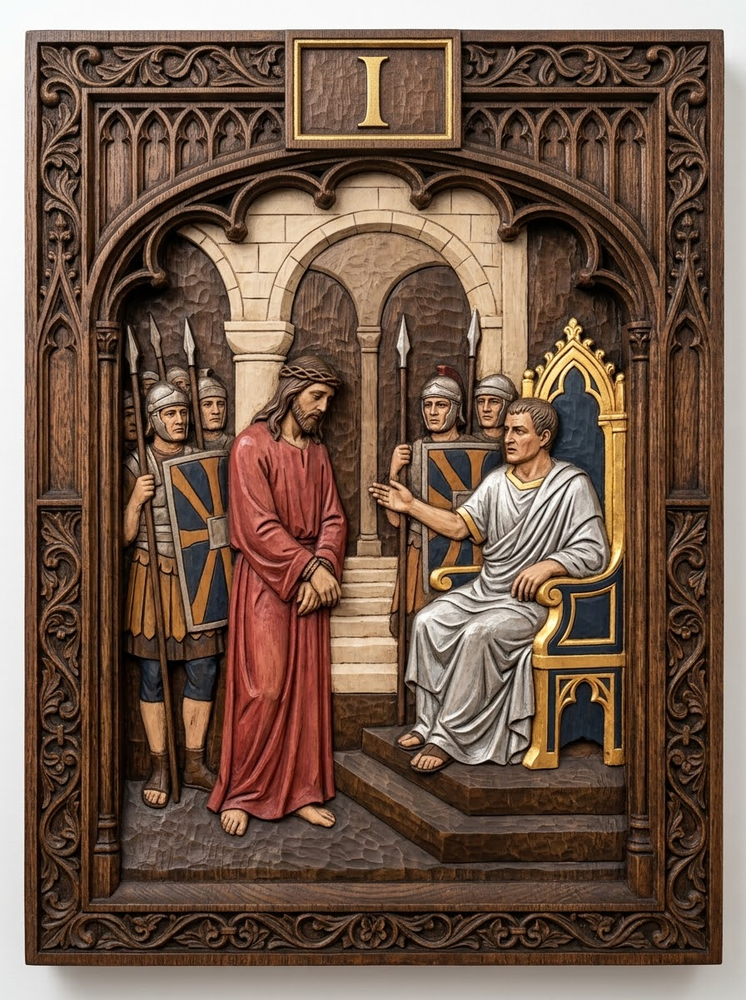
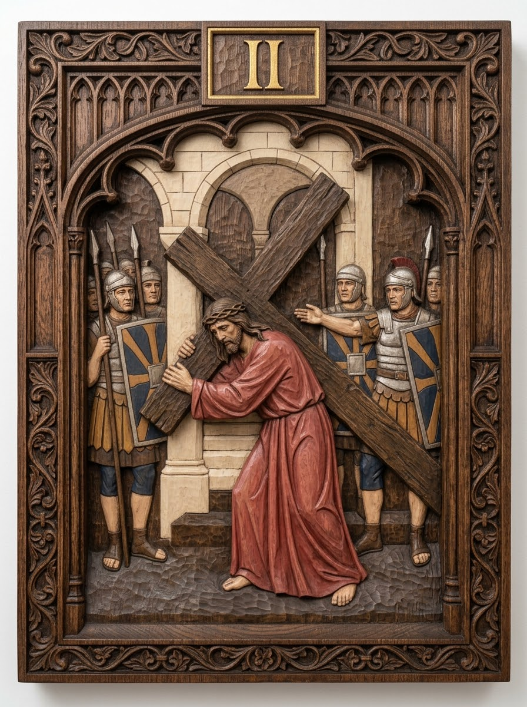
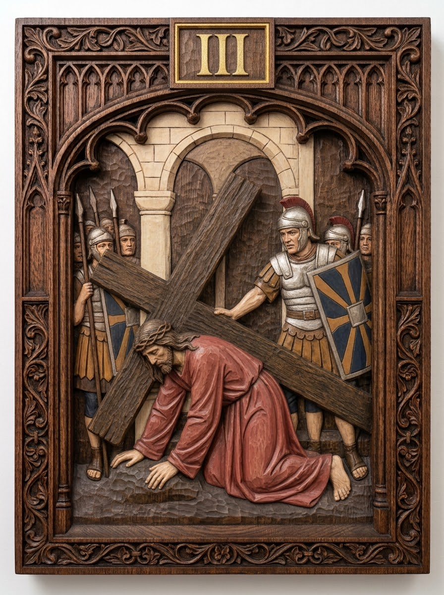
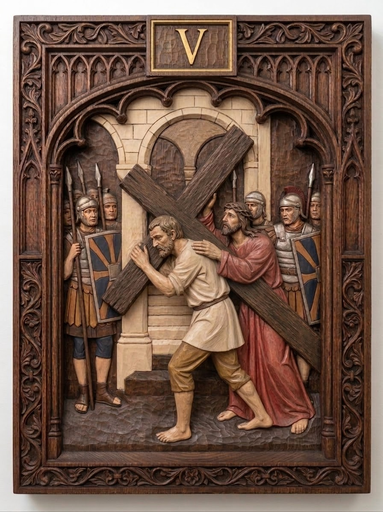
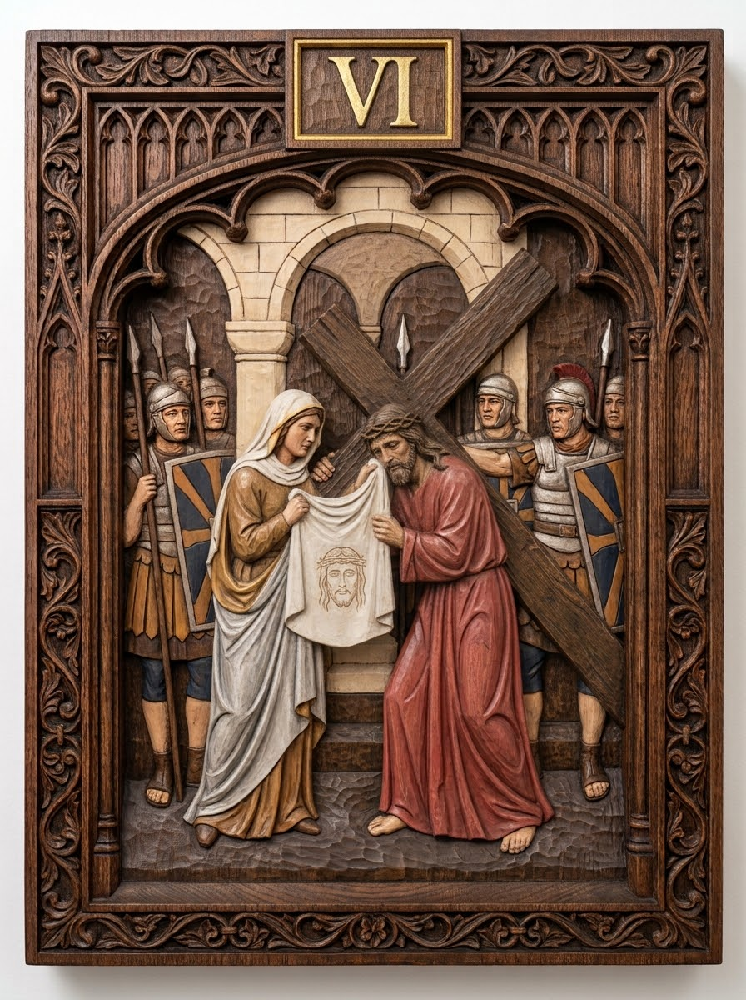
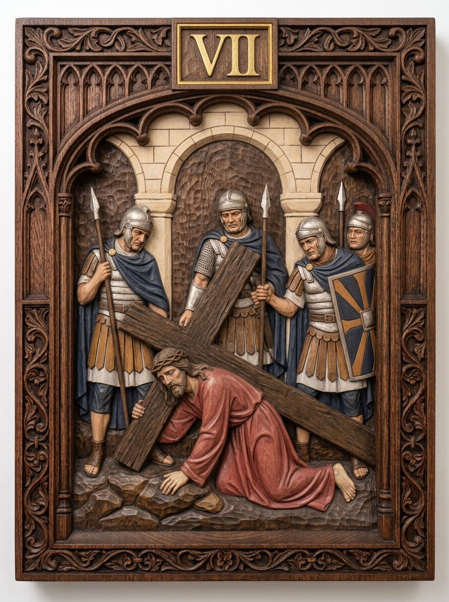
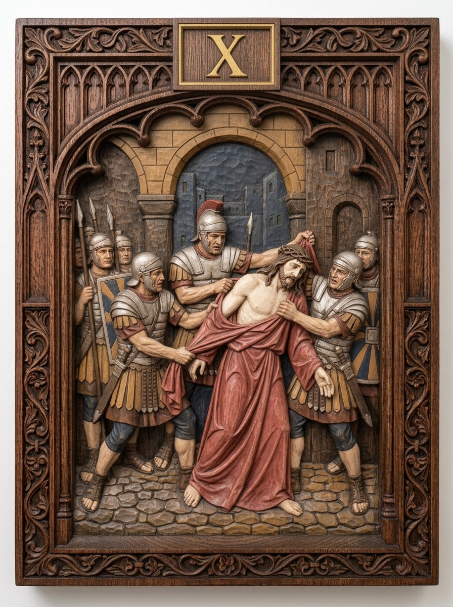
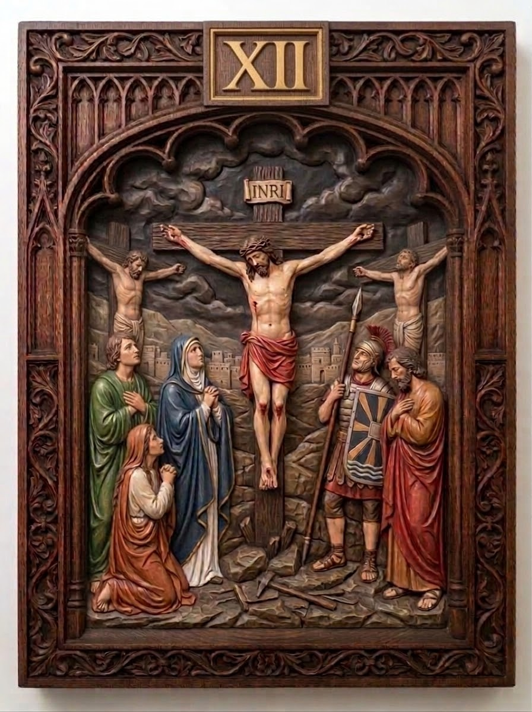
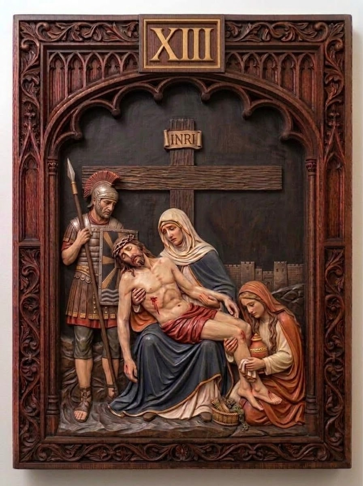

# Stations of the Cross — Set 01

The first Via Crucis series: the 14 traditional stations plus the
Resurrection, 15 images in all.

## Source

Generated by the repository owner with **Google Gemini Pro**, not photographed
or copied from an existing carving. Collected in the Google Photos album
<https://photos.app.goo.gl/EdYMHR8VvGUWcRZD9> (unreachable from the environment
this repository was built in) and uploaded here directly.

All 15 images are imported, 896×1200 JPEG. Each was filed by reading the gilt
Roman numeral carved into its frame.

## Style

Carved and polychromed wood relief panels in Gothic tracery frames — dark oak,
cream limestone, a crimson robe for Christ, Marian blue, ochre, silver armour,
gilt numerals. Portrait 3:4.

The panels are not uniform:

| Panels | Treatment |
|---|---|
| I–X | Shallow relief against a cream limestone arcade; lighter oak frame with pierced tracery |
| XI–XIV | Deeper, more crowded high relief; darker red-brown wood; plainer ogee arch; open landscape instead of the arcade |
| XV | Tracery frame again, set inside the rock tomb |

This matters less for the models than it looks. Model the frame once as a
reusable component and drop all 15 scenes into it, and pick one relief depth
for the whole set — neither is inherited from the reference image.

The backgrounds are worth leaving alone. The setting shifts at XI because the
narrative does, leaving the praetorium for Golgotha, and carved sets have always
let the scenery follow the story.

## Re-importing

If images are ever replaced, drop them in `_inbox/` and run from the repo root:

```sh
scripts/import_images.py collections/stations-of-the-cross/set-01 --dry-run
scripts/import_images.py collections/stations-of-the-cross/set-01 --move
```

The script files each image by the station number in its filename, renames it
into `stations/<NN-slug>/reference/`, and updates `metadata.json`.

## Stations

Each links to its folder — reference image, notes, and working files.

| # | Station | Português | Panel |
|---|---|---|---|
| I | [Jesus is condemned to death](stations/01-jesus-is-condemned-to-death/) | Jesus é condenado à morte |  |
| II | [Jesus carries His cross](stations/02-jesus-carries-his-cross/) | Jesus carrega a cruz |  |
| III | [Jesus falls the first time](stations/03-jesus-falls-the-first-time/) | Jesus cai pela primeira vez |  |
| IV | [Jesus meets His mother](stations/04-jesus-meets-his-mother/) | Jesus encontra sua Mãe |  |
| V | [Simon of Cyrene helps Jesus carry the cross](stations/05-simon-of-cyrene-helps-jesus/) | Simão Cireneu ajuda Jesus a carregar a cruz |  |
| VI | [Veronica wipes the face of Jesus](stations/06-veronica-wipes-the-face-of-jesus/) | Verônica enxuga o rosto de Jesus |  |
| VII | [Jesus falls the second time](stations/07-jesus-falls-the-second-time/) | Jesus cai pela segunda vez |  |
| VIII | [Jesus meets the women of Jerusalem](stations/08-jesus-meets-the-women-of-jerusalem/) | Jesus consola as mulheres de Jerusalém |  |
| IX | [Jesus falls the third time](stations/09-jesus-falls-the-third-time/) | Jesus cai pela terceira vez |  |
| X | [Jesus is stripped of His garments](stations/10-jesus-is-stripped-of-his-garments/) | Jesus é despojado das vestes |  |
| XI | [Jesus is nailed to the cross](stations/11-jesus-is-nailed-to-the-cross/) | Jesus é pregado na cruz |  |
| XII | [Jesus dies on the cross](stations/12-jesus-dies-on-the-cross/) | Jesus morre na cruz |  |
| XIII | [Jesus is taken down from the cross](stations/13-jesus-is-taken-down-from-the-cross/) | Jesus é descido da cruz |  |
| XIV | [Jesus is laid in the tomb](stations/14-jesus-is-laid-in-the-tomb/) | Jesus é sepultado |  |
| XV | [The Resurrection of the Lord](stations/15-the-resurrection/) | A Ressurreição do Senhor |  |

## Rights

The panels are the owner's own generated work — no third-party artist's rights
are involved, and Google's Gemini terms assign ownership of the output to the
user. Two things still worth knowing:

- **The source images themselves are probably not copyrightable.** In the US
  and several other jurisdictions, purely AI-generated images without
  substantial human authorship do not attract copyright. The 3D models sculpted
  from them are original work and are protected normally.
- **Gemini output carries SynthID watermarking**, invisible but detectable, and
  it survives in these JPEGs. It does not restrict use; it just means the
  images are identifiable as AI-generated.

`licence` in `metadata.json` is still `TBD`. For devotional models meant to
reach parishes, CC BY-SA (share alike) or CC BY-NC (non-commercial) are the
usual choices — worth deciding before the first model is distributed.
