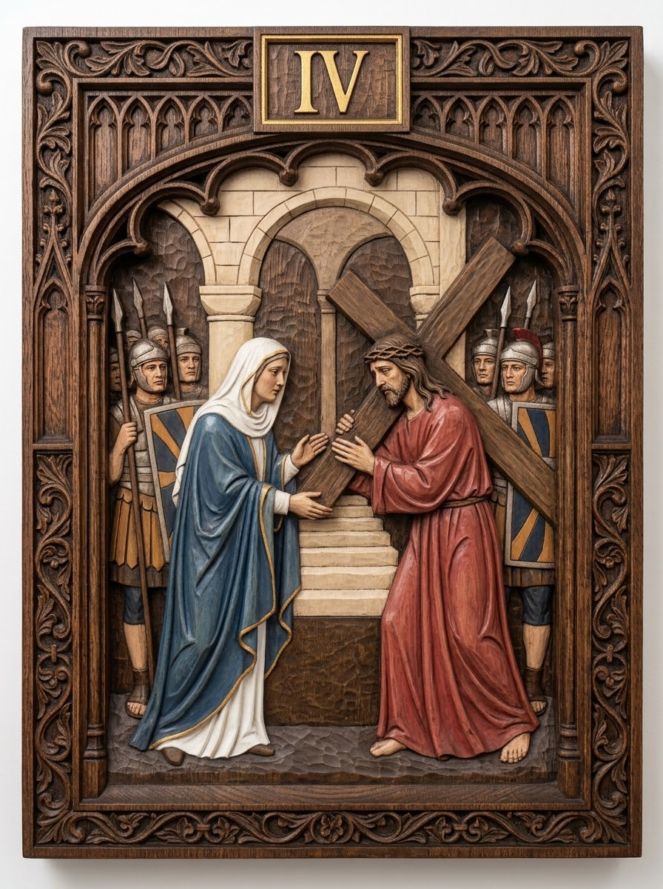

# Station 4 — Jesus meets His mother

| | |
|---|---|
| **Number** | 4 of 15 |
| **Slug** | `04-jesus-meets-his-mother` |
| **Português** | Jesus encontra sua Mãe |
| **Latina** | Iesus Matri suae occurrit |
| **Scripture** | Lk 2:34-35 |
| **Set** | Stations of the Cross — Set 01 |

## Reference image

A carved and polychromed wood relief panel in a Gothic tracery frame,
numbered in gilt. See `../../metadata.json` for the provenance and licence.

## Modelling notes

Mary stands at left in a blue mantle over white, hands reaching toward her Son; Jesus at right steadies the cross, their hands nearly meeting over the beam. Soldiers flank both sides, steps rise behind.

- **Figures:** Jesus, the Blessed Virgin, 6 soldiers
- **Relief depth:** TBD — see `docs/printing-guide.md` (8–15% of panel height)
- **Focal point:** The gap between their two pairs of hands
- **Watch when printing:** The near-touching hands (keep a printable bridge or a clean gap), Mary's mantle edge

## Print notes

<!-- Filled in after the first test print. -->

- Recommended size:
- Orientation:
- Supports:
- Layer height:

## Status

- [x] Reference image imported
- [ ] Model sculpted
- [ ] Mesh checked (manifold, no self-intersections)
- [ ] Exported to `model/export/`
- [ ] Test printed
- [ ] Render made
