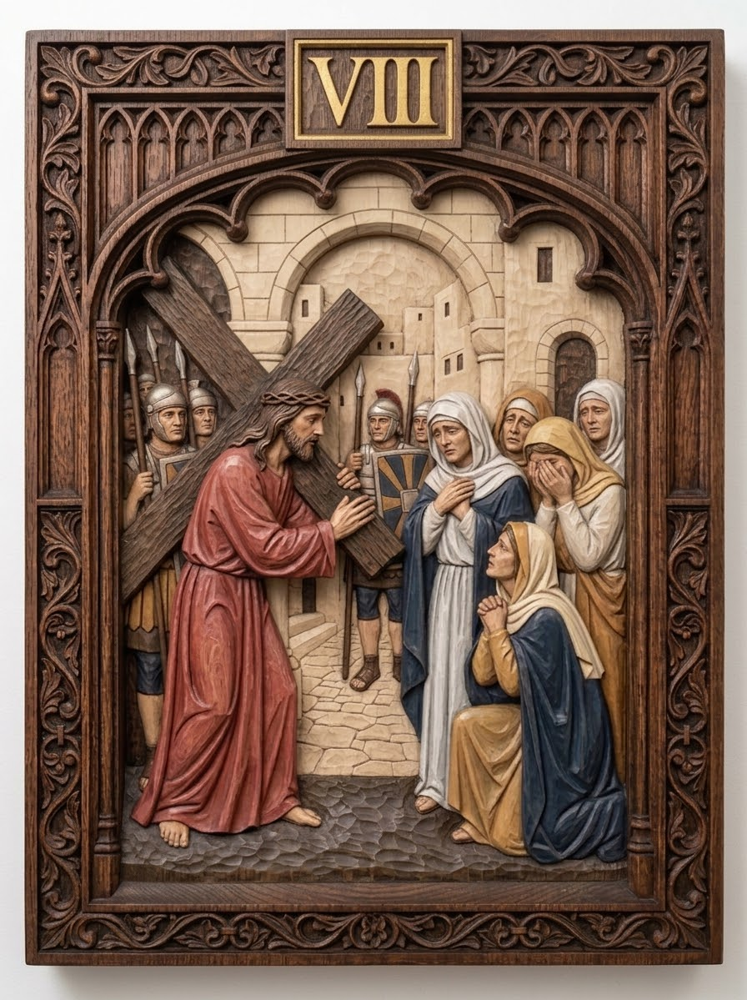

# Station 8 — Jesus meets the women of Jerusalem

| | |
|---|---|
| **Number** | 8 of 15 |
| **Slug** | `08-jesus-meets-the-women-of-jerusalem` |
| **Português** | Jesus consola as mulheres de Jerusalém |
| **Latina** | Iesus mulieres Ierusalem consolatur |
| **Scripture** | Lk 23:27-28 |
| **Set** | Stations of the Cross — Set 01 |

## Reference image

A carved and polychromed wood relief panel in a Gothic tracery frame,
numbered in gilt. See `../../metadata.json` for the provenance and licence.

## Modelling notes

Jesus stands at left turning back toward four women of Jerusalem grouped at right — one kneeling in blue and ochre, one covering her face. City walls and a cobbled street behind; soldiers at the left edge.

- **Figures:** Jesus, 4 women of Jerusalem, 3 soldiers
- **Relief depth:** TBD — see `docs/printing-guide.md` (8–15% of panel height)
- **Focal point:** The turn of Jesus' head toward the women
- **Watch when printing:** The women's veil edges, the kneeling woman's clasped hands

## Print notes

<!-- Filled in after the first test print. -->

- Recommended size:
- Orientation:
- Supports:
- Layer height:

## Status

- [x] Reference image imported
- [ ] Model sculpted
- [ ] Mesh checked (manifold, no self-intersections)
- [ ] Exported to `model/export/`
- [ ] Test printed
- [ ] Render made
