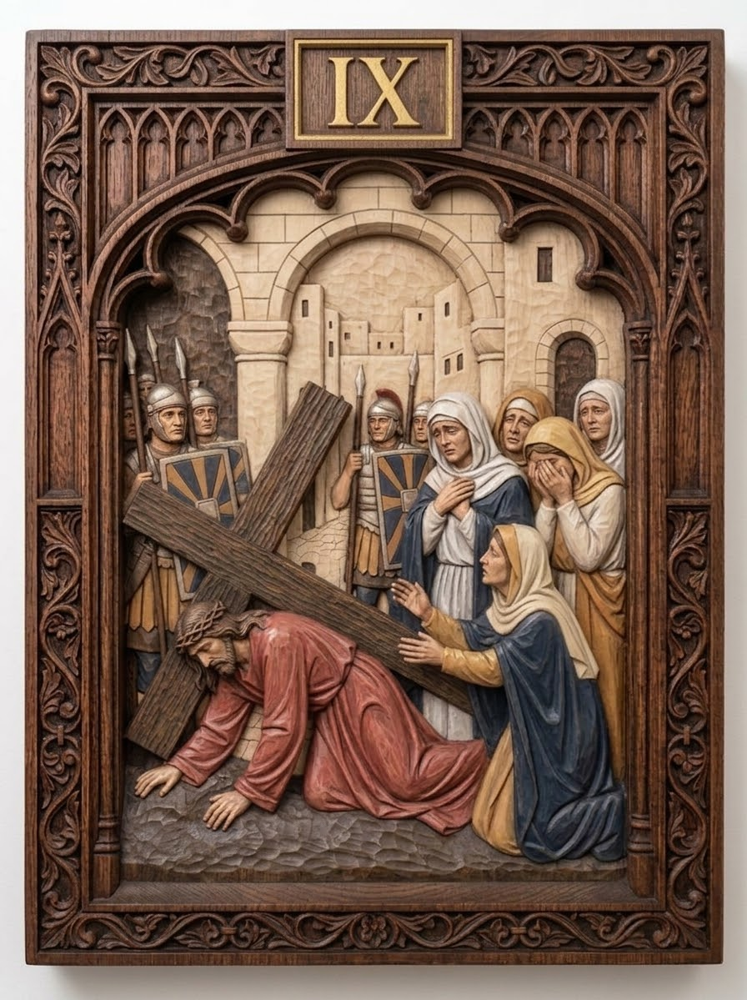

# Station 9 — Jesus falls the third time

| | |
|---|---|
| **Number** | 9 of 15 |
| **Slug** | `09-jesus-falls-the-third-time` |
| **Português** | Jesus cai pela terceira vez |
| **Latina** | Iesus tertium cadit |
| **Scripture** | Lam 3:27-30 |
| **Set** | Stations of the Cross — Set 01 |

## Reference image

A carved and polychromed wood relief panel in a Gothic tracery frame,
numbered in gilt. See `../../metadata.json` for the provenance and licence.

## Modelling notes

Jesus falls a third time at lower left, both hands on the pavement, the cross heavy across his back. The women kneel and stand at right, one reaching toward him. Jerusalem's walls rise behind.

- **Figures:** Jesus, 5 women, 3 soldiers
- **Relief depth:** TBD — see `docs/printing-guide.md` (8–15% of panel height)
- **Focal point:** Both of Jesus' hands flat on the stones
- **Watch when printing:** Outstretched fingers, veil edges, distant architecture (flatten it)

## Print notes

<!-- Filled in after the first test print. -->

- Recommended size:
- Orientation:
- Supports:
- Layer height:

## Status

- [x] Reference image imported
- [ ] Model sculpted
- [ ] Mesh checked (manifold, no self-intersections)
- [ ] Exported to `model/export/`
- [ ] Test printed
- [ ] Render made
