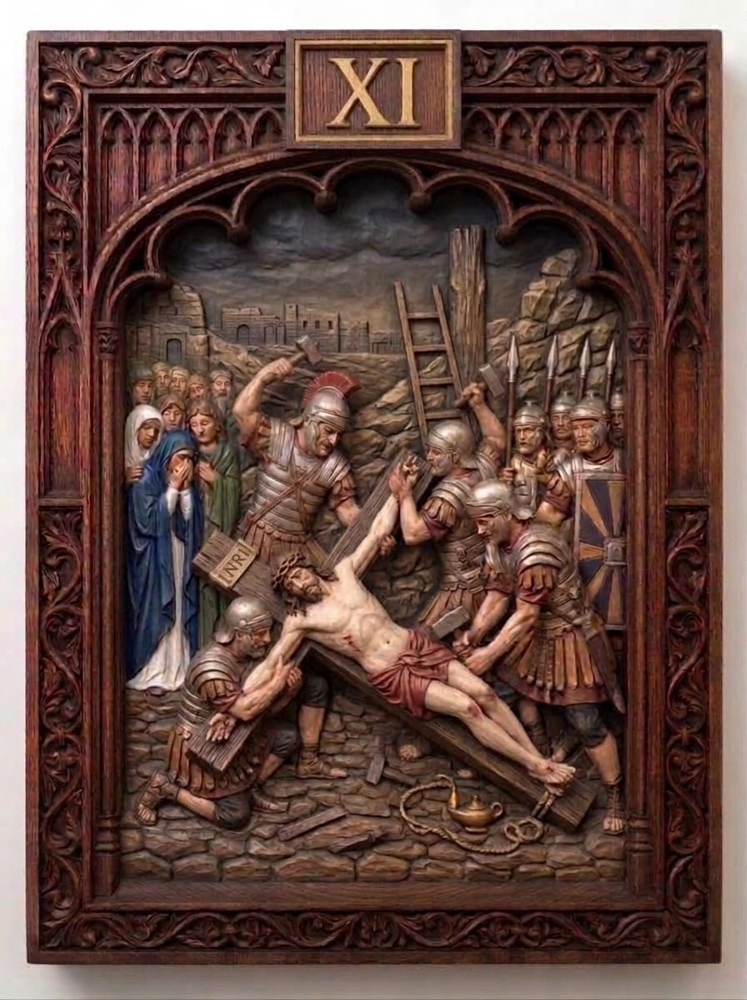

# Station 11 — Jesus is nailed to the cross

| | |
|---|---|
| **Number** | 11 of 15 |
| **Slug** | `11-jesus-is-nailed-to-the-cross` |
| **Português** | Jesus é pregado na cruz |
| **Latina** | Iesus cruci affigitur |
| **Scripture** | Lk 23:33-34 |
| **Set** | Stations of the Cross — Set 01 |

## Reference image

A carved and polychromed wood relief panel in a Gothic tracery frame,
numbered in gilt. See `../../metadata.json` for the provenance and licence.

## Modelling notes

Deeper, more crowded relief. Christ is nailed to the cross laid flat on the ground; a soldier drives the nail with a raised hammer, another pins the arm. The INRI titulus rests on the stones at left, a ladder leans against the rock, an oil lamp and coiled rope lie in the foreground. Mary and the holy women weep at left, soldiers mass at right. Storm sky.

- **Figures:** Christ, the Blessed Virgin, 4 holy women, 8 soldiers
- **Relief depth:** TBD — see `docs/printing-guide.md` (8–15% of panel height)
- **Focal point:** The hammer at the top of its swing, above the pierced hand
- **Watch when printing:** Hammer heads, ladder rungs, the rope coil, spear tips — the ladder is the most fragile element in the set

## Print notes

<!-- Filled in after the first test print. -->

- Recommended size:
- Orientation:
- Supports:
- Layer height:

## Status

- [x] Reference image imported
- [ ] Model sculpted
- [ ] Mesh checked (manifold, no self-intersections)
- [ ] Exported to `model/export/`
- [ ] Test printed
- [ ] Render made
