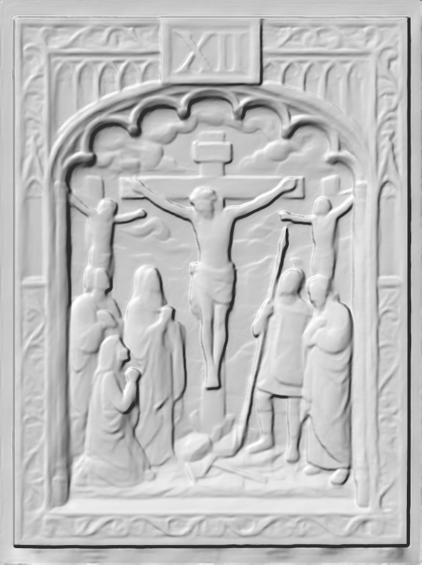

# Station 12 — Jesus dies on the cross

| | |
|---|---|
| **Number** | 12 of 15 |
| **Slug** | `12-jesus-dies-on-the-cross` |
| **Português** | Jesus morre na cruz |
| **Latina** | Iesus in cruce moritur |
| **Scripture** | Lk 23:44-46 |
| **Set** | Stations of the Cross — Set 01 |

## Reference image

A carved and polychromed wood relief panel in a Gothic tracery frame,
numbered in gilt. See `../../metadata.json` for the provenance and licence.

## Modelling notes

The Crucifixion. Three crosses, Christ's at centre with the INRI titulus, the thieves left and right. Below: John in green, Mary in blue, the Magdalene kneeling in orange and white; a centurion with spear and a bearded man at right. Dark sky over the city.

- **Figures:** Christ, two thieves, the Blessed Virgin, St John, St Mary Magdalene, centurion, 1 elder
- **Relief depth:** TBD — see `docs/printing-guide.md` (8–15% of panel height)
- **Focal point:** Christ's body against the dark sky, the panel's brightest mass
- **Watch when printing:** The two outer crosses (thin arms), the INRI board, the spear

## First pass — automated

Built by `.github/workflows/relief.yml`: depth estimated from the reference,
meshed at 150 mm wide and 12 mm deep. 431,730 triangles, 287 cm3, watertight.
The depth map is in `model/source/`; the STL is a run artifact, not committed.

What it got right — the whole composition survives. Christ stands proud at the
centre, the mourners read in front of him, the three crosses separate cleanly,
and the panel reads as a carving rather than a stamped photograph.

What still needs hands:

- **Faces are featureless.** Every head is a smooth blob. This is the limit of
  a depth estimate and no amount of parameter tuning fixes it — they have to be
  sculpted.
- **The Gothic tracery is mush.** The pierced arcading down both sides of the
  frame comes out as soft ripples. Model the frame as real geometry instead and
  reuse it across all fifteen; do not take it from the depth map.
- **A raised lip along the bottom edge**, an artifact of the depth estimate
  running out at the image border. Crop or flatten it before printing.
- **The relief is softer than the carving.** Everything is slightly melted.
  Sharpening the depth map before meshing (`--gamma`, or dodge and burn by hand)
  recovers some of the crispness.

## Print notes

<!-- Filled in after the first test print. -->

- Recommended size:
- Orientation:
- Supports:
- Layer height:

## Status

- [x] Reference image imported
- [ ] Model sculpted
- [ ] Mesh checked (manifold, no self-intersections)
- [ ] Exported to `model/export/`
- [ ] Test printed
- [ ] Render made
