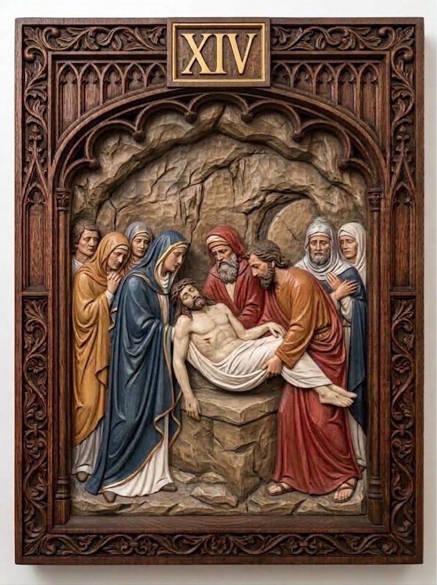

# Station 14 — Jesus is laid in the tomb

| | |
|---|---|
| **Number** | 14 of 15 |
| **Slug** | `14-jesus-is-laid-in-the-tomb` |
| **Português** | Jesus é sepultado |
| **Latina** | Iesus in sepulcro ponitur |
| **Scripture** | Mt 27:59-60 |
| **Set** | Stations of the Cross — Set 01 |

## Reference image

A carved and polychromed wood relief panel in a Gothic tracery frame,
numbered in gilt. See `../../metadata.json` for the provenance and licence.

## Modelling notes

The entombment, inside the rock tomb. Christ's body is lowered onto the stone slab by Joseph of Arimathea and Nicodemus; Mary in blue stands behind, mourners crowd both sides. The carved rock vault fills the whole arch.

- **Figures:** Christ, the Blessed Virgin, Joseph of Arimathea, Nicodemus, 6 mourners
- **Relief depth:** TBD — see `docs/printing-guide.md` (8–15% of panel height)
- **Focal point:** The white shroud under the body, brightest against the rock
- **Watch when printing:** The shroud's folds, the crowd's overlapping hands and veils

## Print notes

<!-- Filled in after the first test print. -->

- Recommended size:
- Orientation:
- Supports:
- Layer height:

## Status

- [x] Reference image imported
- [ ] Model sculpted
- [ ] Mesh checked (manifold, no self-intersections)
- [ ] Exported to `model/export/`
- [ ] Test printed
- [ ] Render made
