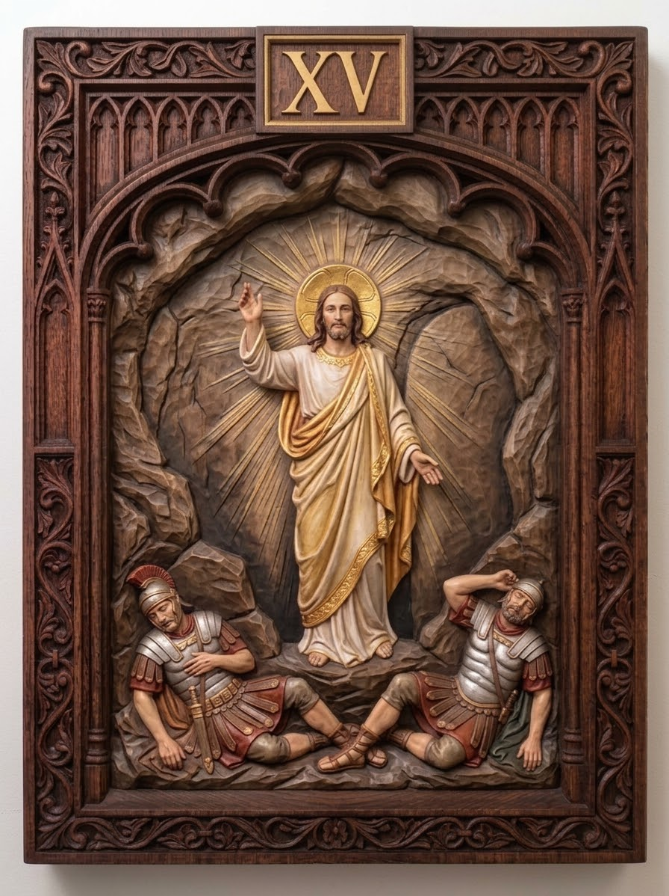

# The Resurrection of the Lord — companion panel

**Not one of the fourteen stations.** The Via Crucis is fourteen; the
Resurrection is a common addition in modern devotion, and this set ships it
alongside them. The `15` in the folder name is a permanent item id, not a
station number — see
[ADR-0012](../../../../../docs/adr/0012-the-resurrection-is-a-companion-not-a-station.md).

| | |
|---|---|
| **Role** | Companion panel (the set has 14 stations) |
| **Slug** | `15-the-resurrection` |
| **Português** | A Ressurreição do Senhor |
| **Latina** | Resurrectio Domini |
| **Scripture** | Mt 28:5-6 |
| **Set** | Stations of the Cross — Set 01 |

## Reference image

A carved and polychromed wood relief panel in a Gothic tracery frame,
numbered in gilt. See `../../metadata.json` for the provenance and licence.

## Modelling notes

The Resurrection. Christ stands at the mouth of the tomb in white and gold, right hand raised in blessing, a halo and a fan of golden rays behind him. Two soldiers sprawl asleep and recoiling on the rocks below, left and right.

- **Figures:** The Risen Christ, 2 soldiers
- **Relief depth:** TBD — see `docs/printing-guide.md` (8–15% of panel height)
- **Focal point:** The raised hand of blessing, on the axis of the rays
- **Watch when printing:** The radiating rays and the halo rim — model them as a raised disc, not free-standing spokes

## Print notes

<!-- Filled in after the first test print. -->

- Recommended size:
- Orientation:
- Supports:
- Layer height:

## Status

- [x] Reference image imported
- [ ] Model sculpted
- [ ] Mesh checked (manifold, no self-intersections)
- [ ] Exported to `model/export/`
- [ ] Test printed
- [ ] Render made
